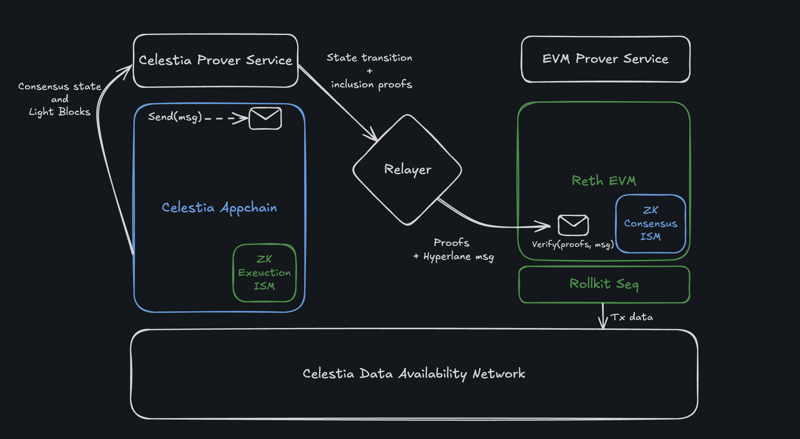
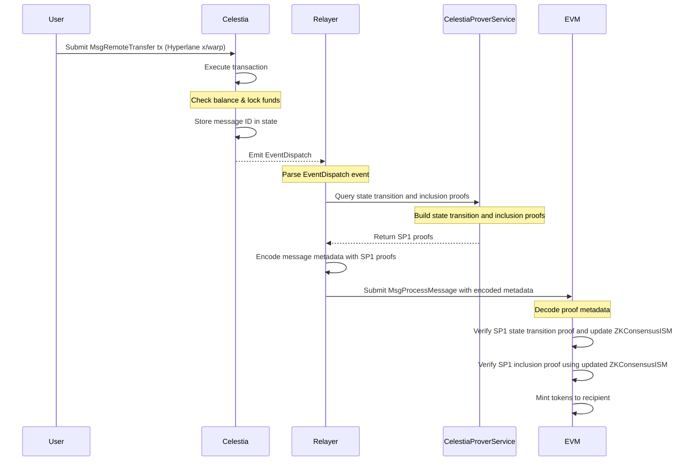
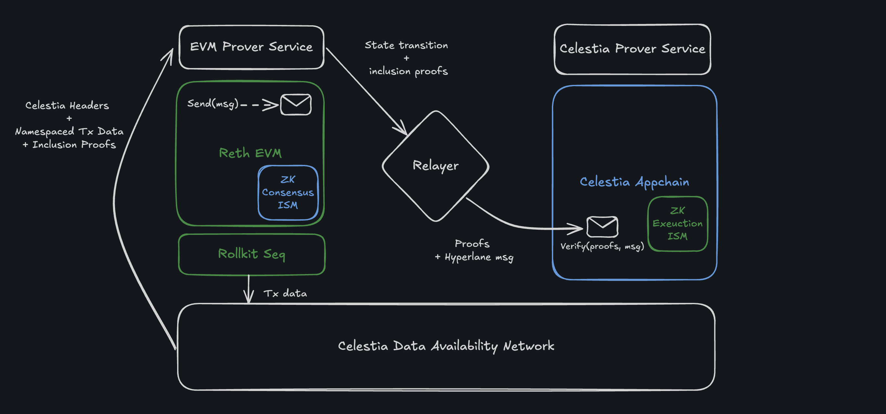
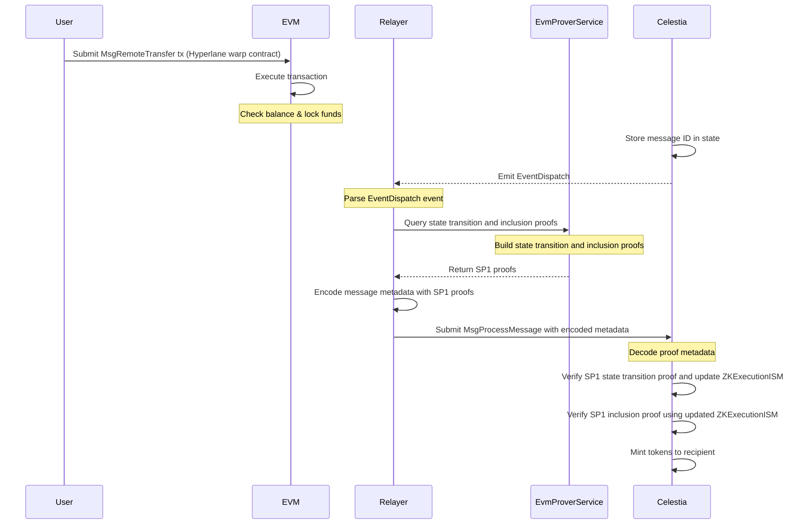

# Architecture

This document contains system architecture diagrams and high-level control flow sequences to illustrate and support understanding of end-to-end token bridging between Celestia and EVM Layer 2 chains that leverage Celestia for data availability.

## Celestia to EVM token transfer flow

Below is a step-by-step sequence diagram to aid understanding of the diagram above.

1.	**Transfer message.**
The user initiates the transfer by submitting a `MsgRemoteTransfer` transaction to Celestia. This transaction includes details like the recipient address, token amount, and the destination domain.
2.	**Celestia executes the transaction.**
Celestia processes the transaction by checking the user’s balance and locking the funds as a collateral token. A message ID is stored in the chain state to serve as a commitment.
Subsequently, this results in a Hyperlane `EventDispatch` carrying a message payload that contains a nonce, version, origin and destination domain identifiers, and message body [see: Message reference](https://docs.hyperlane.xyz/docs/reference/developer-tools/libraries/message).
3.	**Relayer listens and queries for proofs.**
The relayer watches for `EventDispatch` emissions. When detected, it queries Celestia for the stored message commitment (based on a standardised storage path). The commitment serves as proof that the origin chain has locked the funds as well as a replay-protection mechanism.
4.	**Proof generation by CelestiaProverService.**
In order for the EVM chain to mint synthetic tokens on behalf of the locked collateral tokens, the relayer must present two SP1 proofs:
	- A state transition proof showing Celestia’s current state evolved from a previously known (trusted) state. This allows the EVM to trust the new state root.
	- A state inclusion proof showing that the commitment (message ID) is a valid Merkle leaf in the Celestia state tree.
5.	**SP1 proof generation.**
The relayer submits these queries to the `CelestiaProverService`, which runs zk circuits built using SP1:
	- One circuit verifies header-to-header state transitions using the Tendermint lightclient skipping-verification algorithm.
	- The other verifies IAVL Merkle inclusion of the commitment (message ID).
6.	**Relayer submits proofs + message to EVM.**
Once both proofs are ready, the relayer encodes them into `ZKConsensusISMMetadata` alongside the Hyperlane message to be relayed. A `MsgProcessMessage` is then submitted to the EVM chain.
7.	**EVM verifies proofs and processes the message.**
The EVM chain decodes the proofs, verifies them using its `ZKConsensusISM` contract, and ensures that the commitment (message ID) exists in Celestia’s state. If valid, it mints the synthetic tokens on behalf of the recipient and emits a new `EventProcess` signalling its completion.

## EVM to Celestia token transfer flow

Below is a step-by-step sequence diagram to aid understanding of the diagram above.

1.	**Transfer message.**
The user initiates the transfer by invoking the `transferRemote` method of the Solidity contract through a transaction to the EVM chain. This transaction includes details like the recipient address, token amount, and the destination domain.
2.	**EVM executes the transaction.**
The EVM chain processes the transaction by checking the user’s balance and locking the funds as a collateral token. A message ID is stored in the chain state to serve as a commitment.
Subsequently, this results in a Hyperlane `EventDispatch` carrying a message payload that contains a nonce, version, origin and destination domain identifiers, and message body [see: Message reference](https://docs.hyperlane.xyz/docs/reference/developer-tools/libraries/message).
3.	**Relayer listens and queries for proofs.**
The relayer watches for `EventDispatch` emissions. When detected, it queries the EVM chain for the stored message commitment (based on a standardised storage path). The commitment serves as proof that the origin chain has locked the funds as well as a replay-protection mechanism.
4.	**Proof generation by EvmProverService.**
In order for Celestia to mint synthetic tokens on behalf of the locked collateral tokens, the relayer must present two SP1 proofs:
	- A state transition proof showing the EVM chain's current state evolved from a previously known (trusted) state. This allows Celestia to trust the new state root.
	- A state inclusion proof showing that the commitment (message ID) is a valid Merkle leaf in the EVM chain state tree.
5.	**SP1 proof generation.**
The relayer submits these queries to the `EvmProverService`, which runs zk circuits built using SP1:
	- The first circuit verifies sequential EVM header-to-header state transitions using [RSP](https://github.com/succinctlabs/rsp/tree/main) and additionally proves blob inclusion in Celestia’s data availability layer.
	- The second circuit aggregates a range of such proofs to mimic skipping verification, enabling Celestia to fast-forward its trusted view of EVM chain state.
    - The third circuit verifies Merkle inclusion of the commitment (message ID).
6.	**Relayer submits proofs + message to Celestia.**
Once both proofs are ready, the relayer encodes them into `ZKExecutionISMMetadata` alongside the Hyperlane message to be relayed. A `MsgProcessMessage` is then submitted to Celestia.
7.	**Celestia verifies proofs and processes the message.**
Celestia decodes the proofs, verifies them using its `ZKExecutionISM` module, and ensures that the commitment (message ID) exists in the EVM chain's state. If valid, it mints the synthetic tokens on behalf of the recipient and emits a new `EventProcess` signalling its completion.

### Token return flows

If a user wishes to return tokens to the chain they originated from, the process closely mirrors the initial transfer.
Instead of locking and minting, the protocol _burns_ the synthetic tokens on the destination chain and _unlocks_ the corresponding collateral token on the origin chain.