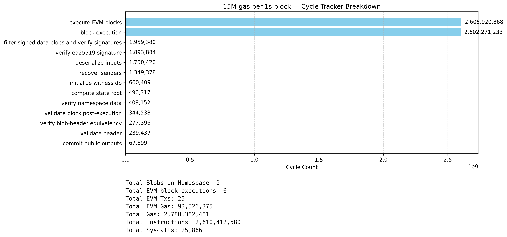
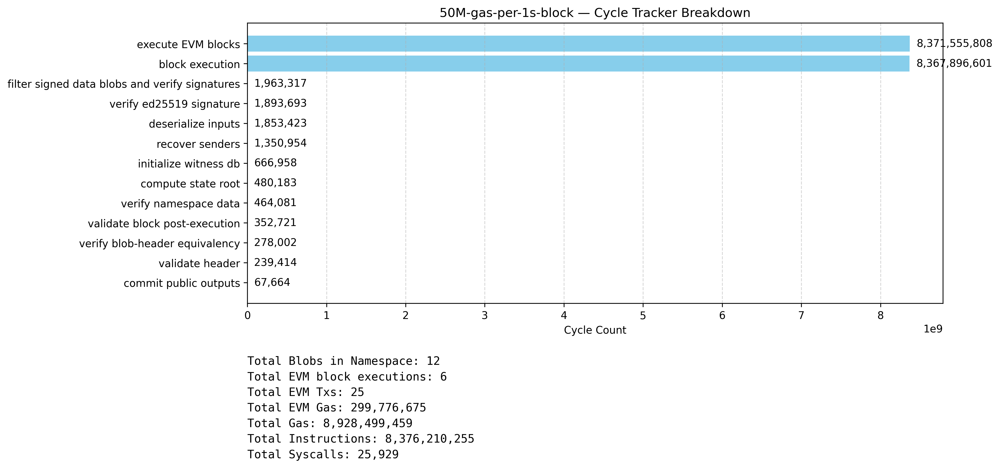
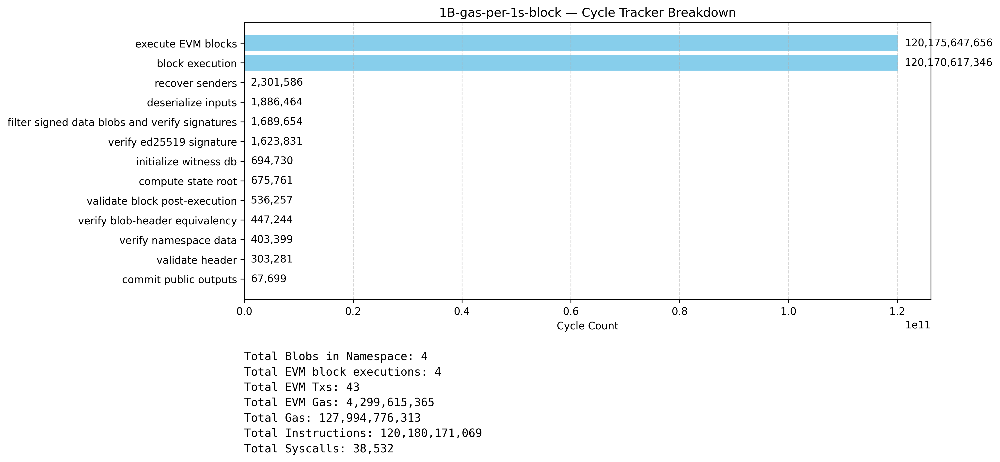
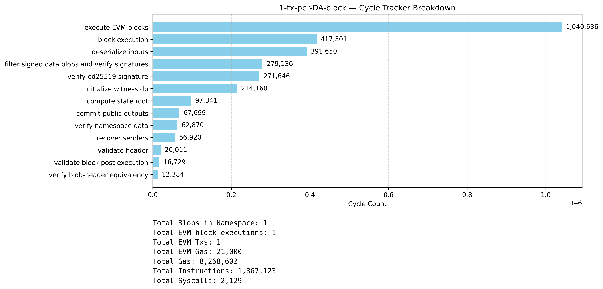
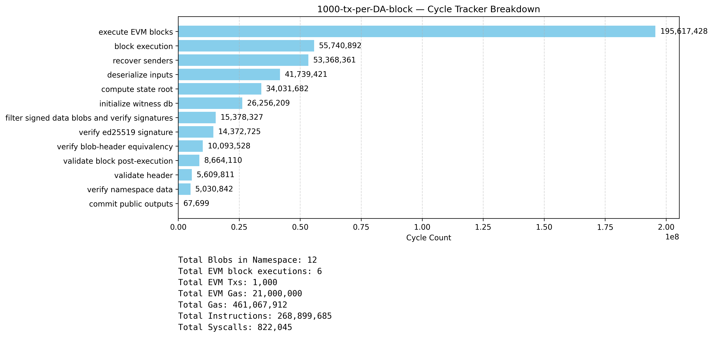
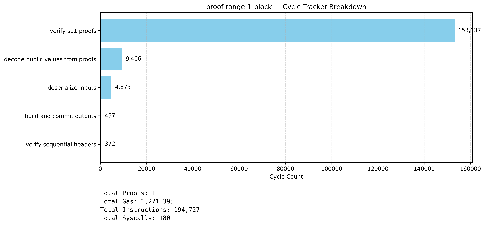
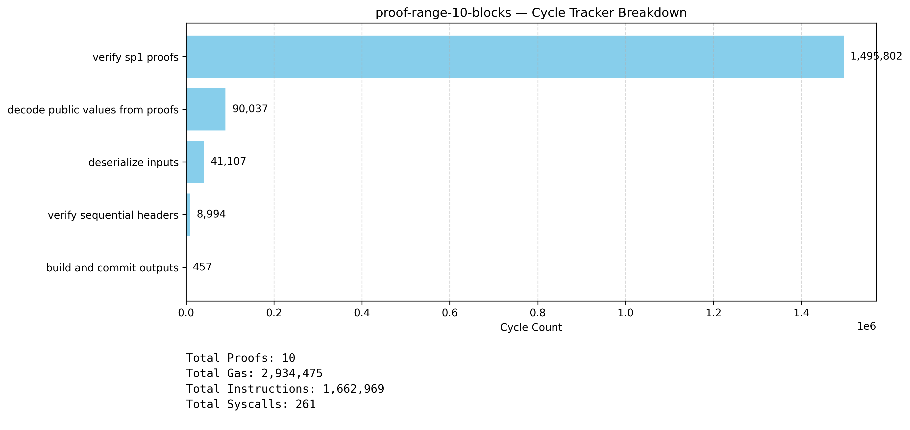

# Benchmarks 1

The following document contains initial benchmarks for various scenarios running both the SP1 block execution and range aggregation programs.

### Latency estimates
> All estimated proving times as per [SP1 Prover Network Latency Estimates](https://docs.google.com/spreadsheets/d/1--LmJ_UbI7EspOdYiZBpmAYEojR9CFudk1H45hJT_cY/edit?gid=578931512#gid=578931512).

The SP1 latency estimates table was fed to chatgpt to estimate values given the prover gas units (PGUs) below.
These are estimates, but should serve as a rough guideline. The last two gas points (1B EVM block Gas/s) are extrapolations beyond the table’s max (12,451,487,697 PGUs), so treat those with a wider error band.

### Results

⚠️ The `execute EVM blocks` metric is inclusive of all the RSP profiles, i.e. `block execution`, `recover senders`, `initialze witness db`, `compute state root`, `validate block post execution`.
 
#### 15M Gas/s, single DA block



For 2,788,382,481 PGUs, the estimated SP1 proving times are:
- 8 GPUs: ~256.30s (~4 minutes 16 seconds)
- 32 GPUs: ~81.84s (~1 minutes 22 seconds)
    
<details>
  <summary>Expand benchmark JSON data</summary>

```json
{
  "total_blobs": 9,
  "total_blockexec_inputs": 6,
  "total_tx_count": 25,
  "total_evm_gas": 93526375,
  "total_gas": 2788382481,
  "total_instruction_count": 2610412580,
  "total_syscall_count": 25866,
  "cycle_tracker_results": {
    "block execution": 2602271233,
    "compute state root": 490317,
    "execute EVM blocks": 2605920868,
    "verify ed25519 signature": 1893884,
    "commit public outputs": 67699,
    "validate header": 239437,
    "deserialize inputs": 1750420,
    "verify namespace data": 409152,
    "initialize witness db": 660409,
    "verify blob-header equivalency": 277396,
    "validate block post-execution": 344538,
    "filter signed data blobs and verify signatures": 1959380,
    "recover senders": 1349378
  }
}
```
    
</details>details>

---

#### 50M Gas/s, single DA block



For 8,928,499,459 PGUs, the estimated SP1 proving times are:
- 8 GPUs: ~475.36s (~7 minutes 55 seconds)
- 32 GPUs: ~125.14s (~2 minutes 5 seconds)

<details>
  <summary>Expand benchmark JSON data</summary>

```json
{
  "total_blobs": 12,
  "total_blockexec_inputs": 6,
  "total_tx_count": 25,
  "total_evm_gas": 299776675,
  "total_gas": 8928499459,
  "total_instruction_count": 8376210255,
  "total_syscall_count": 25929,
  "cycle_tracker_results": {
    "block execution": 8367896601,
    "compute state root": 480183,
    "execute EVM blocks": 8371555808,
    "verify ed25519 signature": 1893693,
    "commit public outputs": 67664,
    "validate header": 239414,
    "deserialize inputs": 1853423,
    "verify namespace data": 464081,
    "initialize witness db": 666958,
    "verify blob-header equivalency": 278002,
    "validate block post-execution": 352721,
    "filter signed data blobs and verify signatures": 1963317,
    "recover senders": 1350954
  }
}
```

</details>details>

---

#### 150M Gas/s, single DA block


For 27,534,746,042 PGUs, the estimated SP1 proving times are:
- 8 GPUs: ~864.24s (~14 minutes 24 seconds)
- 32 GPUs: ~188.76s (~3 minutes 9 seconds)

<details>
  <summary>Expand benchmark JSON data</summary>

```json
{
  "total_blobs": 12,
  "total_blockexec_inputs": 6,
  "total_tx_count": 25,
  "total_evm_gas": 924776575,
  "total_gas": 27534746042,
  "total_instruction_count": 25847850665,
  "total_syscall_count": 26026,
  "cycle_tracker_results": {
    "block execution": 25839492183,
    "compute state root": 475658,
    "execute EVM blocks": 25843175001,
    "verify ed25519 signature": 1894391,
    "commit public outputs": 67699,
    "validate header": 240285,
    "deserialize inputs": 1872353,
    "verify namespace data": 464319,
    "initialize witness db": 682663,
    "verify blob-header equivalency": 278559,
    "validate block post-execution": 352769,
    "filter signed data blobs and verify signatures": 1963996,
    "recover senders": 1353213
  }
}
```

</details>details>
    
---

#### 1B Gas/s, single DA block



For 127,994,776,313 PGUs, the estimated SP1 proving times are:
- 8 GPUs: ~1,953.61s (~32 minutes 34 seconds)
- 32 GPUs: ~330.71s (~5 minutes 31 seconds)

<details>
  <summary>Expand benchmark JSON data</summary>

```json
{
  "total_blobs": 4,
  "total_blockexec_inputs": 4,
  "total_tx_count": 43,
  "total_evm_gas": 4299615365,
  "total_gas": 127994776313,
  "total_instruction_count": 120180171069,
  "total_syscall_count": 38532,
  "cycle_tracker_results": {
    "block execution": 120170617346,
    "compute state root": 675761,
    "execute EVM blocks": 120175647656,
    "verify ed25519 signature": 1623831,
    "commit public outputs": 67699,
    "validate header": 303281,
    "deserialize inputs": 1886464,
    "verify namespace data": 403399,
    "initialize witness db": 694730,
    "verify blob-header equivalency": 447244,
    "validate block post-execution": 536257,
    "filter signed data blobs and verify signatures": 1689654,
    "recover senders": 2301586
  }
}
```

</details>details>

--- 

#### 1 tx per DA block



For 8,268,602 PGUs, the estimated SP1 proving times are:
- 8 GPUs: ~11.67 seconds
- 32 GPUs: ~9.78 seconds
    
<details>
  <summary>Expand benchmark JSON data</summary>

```json
{
  "total_blobs": 1,
  "total_blockexec_inputs": 1,
  "total_tx_count": 1,
  "total_evm_gas": 21000,
  "total_gas": 8268602,
  "total_instruction_count": 1867123,
  "total_syscall_count": 2129,
  "cycle_tracker_results": {
    "block execution": 417301,
    "compute state root": 97341,
    "execute EVM blocks": 1040636,
    "verify ed25519 signature": 271646,
    "commit public outputs": 67699,
    "validate header": 20011,
    "deserialize inputs": 391650,
    "verify namespace data": 62870,
    "initialize witness db": 214160,
    "verify blob-header equivalency": 12384,
    "validate block post-execution": 16729,
    "filter signed data blobs and verify signatures": 279136,
    "recover senders": 56920
  }
}
```

</details>details>

--- 

#### 1000 txs per DA block



For 461,067,912 PGUs, the estimated SP1 proving times are:
- 8 GPUs: ~98.60 seconds (~1 minute 39 seconds)
- 32 GPUs: ~42.43 seconds
    
<details>
  <summary>Expand benchmark JSON data</summary>

```json
{
  "total_blobs": 12,
  "total_blockexec_inputs": 6,
  "total_tx_count": 1000,
  "total_evm_gas": 21000000,
  "total_gas": 461067912,
  "total_instruction_count": 268899685,
  "total_syscall_count": 822045,
  "cycle_tracker_results": {
    "block execution": 55740892,
    "compute state root": 34031682,
    "execute EVM blocks": 195617428,
    "verify ed25519 signature": 14372725,
    "commit public outputs": 67699,
    "validate header": 5609811,
    "deserialize inputs": 41739421,
    "verify namespace data": 5030842,
    "initialize witness db": 26256209,
    "verify blob-header equivalency": 10093528,
    "validate block post-execution": 8664110,
    "filter signed data blobs and verify signatures": 15378327,
    "recover senders": 53368361
  }
}
```

</details>details>

--- 

#### 1 block range aggregation


For 2,934,475 PGUs, the estimated SP1 proving times are:
- 8 GPUs: ~4.32 seconds + (5 - 10 seconds: groth16)
- 32 GPUs: ~4.94 seconds + (5 - 10 seconds: groth16)

---

#### 10 block range aggregation


For 2,934,475 PGUs, the estimated SP1 proving times are:
- 8 GPUs: ~6.73 seconds + (5 - 10 seconds: groth16)
- 32 GPUs: ~6.70 seconds + (5 - 10 seconds: groth16)

The [SP1 Prover Network Latency Estimates](https://docs.google.com/spreadsheets/d/1--LmJ_UbI7EspOdYiZBpmAYEojR9CFudk1H45hJT_cY/edit?gid=578931512#gid=578931512) states:

> Final Groth16 or Plonk wrapping will add additional time—if your proof is 20M gas and you want to use Groth16, the total proof generation time should be under 15 seconds.						

### Estimated Costs

The SP1 public network is auction based, however, Succinct offers SLAs for partner teams.

Assuming a dollar cost of $1.50/1B PGUs.


| Benchmark                       | PGU             | Estimated Cost ($USD) | 8 GPUs Latency (s) | 32 GPUs Latency (s) |
|---------------------------------|-----------------|-----------------------|--------------------|---------------------|
| 15M Gas/s, Single DA Block      | 2,788,382,481   | 4.1826                | 256.30             | 81.84               |
| 50M Gas/s, Single DA Block      | 8,928,499,459   | 13.3927               | 475.36             | 125.14              |
| 150M Gas/s, Single DA Block     | 27,534,746,042  | 41.3021               | 864.24             | 188.76              |
| 1B Gas/s, Single DA Block       | 127,994,776,313 | 191.9922              | 1,953.61           | 330.71              |
| 1 EOA tx per DA Block           | 8,268,602       | 0.0124                | 11.67              | 9.78                |
| 1000 EOA txs per DA block       | 461,067,912     | 0.6916                | 98.60              | 42.43               |
| 1 block range groth16           | 1,271,395       | 0.0019                | 4.32 (+5–10s)      | 4.94 (+5–10s)       |
| 10 block range groth16          | 2,934,475       | 0.0044                | 6.73 (+5–10s)      | 6.70 (+5–10s)       |